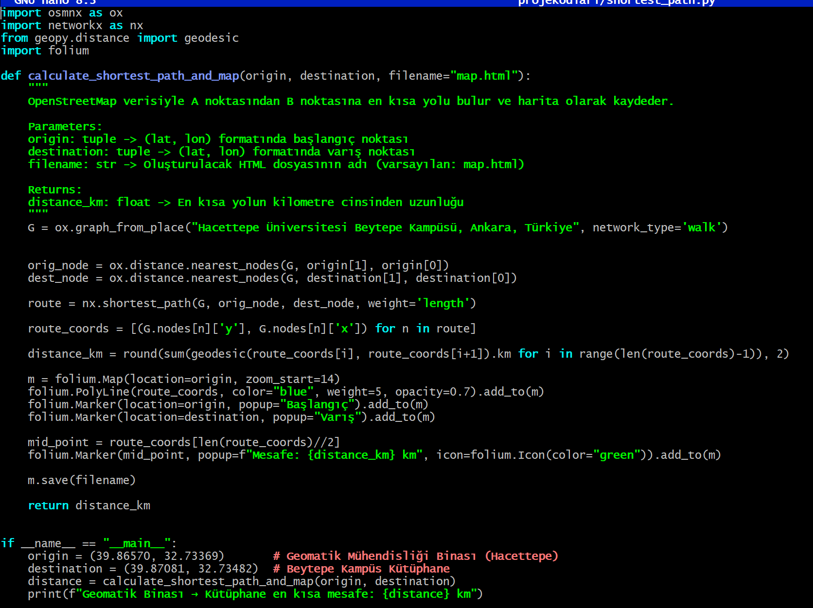
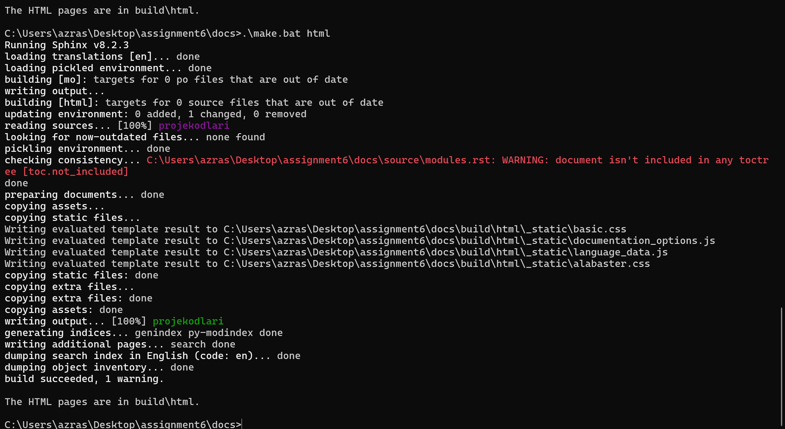

# Shortest Drone Route Finder 📍

This project was developed as part of the **GMT211 - Python Programming** course and aims to determine the shortest walking route between two coordinate points on a university campus using real-world geospatial data.

The main goals of the project include:
- 🗺️ Building a functional Python module (`shortest_path.py`) that leverages OpenStreetMap data via the OSMnx library
- 🔎 Calculating the shortest route using Dijkstra’s algorithm implemented in NetworkX
- 📌 Creating interactive maps with Folium
- 🧪 Testing the function with Pytest
- 📚 Generating full project documentation with Sphinx
- 🐍 Packaging the module and publishing it to [Test PyPI](https://test.pypi.org/)

This repository contains the full implementation, testing suite, documentation setup, and packaging configuration required for a proper Python package pipeline.
---
## Setting Up the Project Structure

First, the empty GitHub repository is cloned to the local machine. Then, the main project structure is created. The `projekodlari` directory contains the Python modules, while the `tests` folder is for test files. Additionally, essential project files such as `setup.py`, `requirements.txt`, `README.md`, and the GitHub Actions workflow file are initialized.


---

## Shortest Path Calculation Function

The core function `calculate_shortest_path_and_map` calculates the shortest path between two geographic coordinates using OpenStreetMap data, and then saves the result as an interactive HTML map. It utilizes the `osmnx`, `networkx`, `geopy`, and `folium` libraries.

- The graph is generated based on the location "Hacettepe University Beytepe Campus, Ankara, Turkey".
- The route is calculated with respect to walking paths.
- The output HTML map contains markers for the start and end points, a route line, and a popup displaying the total distance in kilometers.


---

## Running the Script

The script is executed from the terminal using the following command:

```bash
python projekodlari/shortest_path.py
```


----
## Result Map

The generated HTML map visualizes the shortest walking path from the Geomatics Engineering Building to the Library on the Hacettepe University Beytepe Campus. The route is marked with a blue polyline, and the total distance (0.67 km) is displayed at the midpoint.

Markers:
- 🟢 **Start Point**: Geomatics Engineering Building (`Başlangıç`)
- 🔵 **End Point**: Library (`Varış`)
- 📍 **Popup**: Distance displayed in kilometers


---


## Testing the Shortest Path Function

A simple test function is written to validate the correctness of the `calculate_shortest_path_and_map` function. It verifies:

- ✅ The returned distance is a `float`
- ✅ The distance is greater than zero
- ✅ An HTML file is successfully created as output

The coordinates used in the test represent the same route: from the Geomatics Engineering Building to the Library at Hacettepe University.


---

## Running the Test with Pytest

The test is executed using the `pytest` framework. The output confirms that the test passed successfully. While there are two deprecation warnings related to third-party libraries (`dateutil` and `geopandas`), they do not affect the test result.

- ✅ 1 test passed  
- ⚠️ 2 warnings (from external libraries)


---

## Generating Documentation with Sphinx

Sphinx was used to generate HTML documentation from the source code. During the initial build, several issues were encountered:

- ❌ `automodule` directive was unrecognized due to missing extensions or incorrect configuration.
- ❌ `ModuleNotFoundError` occurred because the `projekodlari.shortest_path` module could not be found by the autodoc extension.
- ⚠️ Some documents were not included in the table of contents (`toctree`) and triggered warnings.

These issues were resolved step-by-step by:
1. Ensuring `sphinx.ext.autodoc` was enabled in `conf.py`.
2. Verifying the module path and fixing import errors.
3. Including all `.rst` files in the TOC.

Once fixed, the documentation was successfully built to the `build/html` directory with only minor warnings remaining.





---

## Sphinx Configuration (conf.py)

The `conf.py` file was configured to enable automatic documentation generation with Sphinx. Key configuration highlights include:

- 📌 **Path Setup**: Adds the project root to `sys.path` for successful module imports.
- 📌 **Project Info**: Sets project name, author, and version.
- ✅ **Enabled Extensions**:
  - `sphinx.ext.autodoc`: Automatically documents from docstrings.
  - `sphinx.ext.napoleon`: Parses Google-style and NumPy-style docstrings.
- 🎨 **HTML Theme**: Set to `alabaster`.
- 📁 **Static and Template Paths**: `_static` and `_templates` directories specified.

These configurations enabled the documentation to compile successfully after resolving import and structure issues.


---

## Documentation Index (index.rst)

The `index.rst` file serves as the main entry point for the Sphinx-generated documentation. It includes:

- 🧭 A **table of contents** defined with the `.. toctree::` directive to structure documentation navigation.
- 📌 A brief **project overview**, highlighting the purpose of the assignment.
- ✨ A **Project Highlights** section summarizing key features:
  - 📍 Based on real-world data from Hacettepe University's Beytepe Campus
  - 🧠 Uses Dijkstra’s algorithm via NetworkX
  - 🗺️ Interactive maps generated with Folium
  - ✅ Tested with pytest
  - 📝 Documented using Sphinx

It also displays the main function's code block using reStructuredText syntax highlighting.


---

## Final HTML Documentation Output

The documentation was successfully built and rendered as an interactive website using Sphinx. The homepage includes:

- 📌 Project title and author information
- 📄 A structured table of contents
- ✨ A summary of the project and its highlights
- 🔗 Navigation links to the `projekodlari` module and its contents

This output demonstrates that the documentation system is correctly configured and includes both narrative content and auto-generated code documentation.


---

## Libraries and Functions Used

| Library        | Function / Module                | Purpose                                                                 |
|----------------|----------------------------------|-------------------------------------------------------------------------|
| `osmnx`        | `graph_from_place`, `nearest_nodes` | To get and interact with street networks from OpenStreetMap            |
| `networkx`     | `shortest_path`                  | To compute the shortest path using Dijkstra’s algorithm                |
| `geopy.distance` | `geodesic`                    | To calculate the geographic distance between coordinates               |
| `folium`       | `Map`, `Polyline`, `Marker`, `Icon` | To create interactive maps and display routes with markers and lines  |
| `os`           | `path.exists`, `path.abspath`     | To handle file paths and check for output file creation                |
| `sys`          | `path.append`, `modules`          | To modify Python path for imports and manage modules dynamically       |
| `pytest`       | `assert` statements               | To validate output and test functionality                              |
| `sphinx.ext.autodoc` | _extension_                 | To generate documentation from docstrings                              |
| `sphinx.ext.napoleon`| _extension_                | To parse Google- and NumPy-style Python docstrings                     |


---

## Conclusion

This project demonstrates the end-to-end development of a Python package—from writing and testing code to generating professional documentation and publishing on Test PyPI.

Throughout the assignment, I practiced:
- Structuring a Python project according to industry standards
- Using open-source geospatial libraries to solve real-world routing problems
- Writing automated tests to validate functionality
- Creating and styling documentation with Sphinx
- Packaging and distributing the project through Test PyPI

This workflow not only helped strengthen my Python programming skills, but also provided a comprehensive introduction to modern software development practices such as testing, documentation, and version control.

🚀 Thank you for reviewing this project!
---
